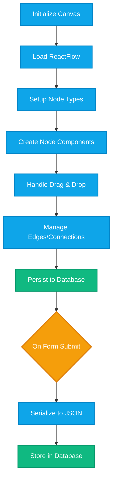

# Visual Workflow Builder — Developer Documentation

> Drag-and-drop interface for designing approval and fulfillment workflows, stored as a JSON graph, rendered and edited via ReactFlow.

---

## Table of Contents

1. [Purpose](#purpose)
2. [Architecture](#architecture)
3. [Core Concepts](#core-concepts)
   - [Node Types](#1-node-types)
   - [Data Structure](#2-data-structure)
   - [Workflow Templates](#3-workflow-templates)
4. [Implementation Steps](#implementation-steps)
   - [Step 1: Initialize Workflow Canvas](#step-1-initialize-workflow-canvas)
   - [Step 2: Define Custom Node Components](#step-2-define-custom-node-components)
   - [Step 3: Handle Drag-and-Drop](#step-3-handle-drag-and-drop)
   - [Step 4: Role Assignment](#step-4-role-assignment)
   - [Step 5: Persist Workflow](#step-5-persist-workflow)

---

## Purpose

Enable non-technical users to define complex approval and fulfillment workflows through a visual interface.

---

## Architecture

```mermaid
graph LR
    classDef startNode fill:#0ea5e9,stroke:#0284c7,stroke-width:2px,color:#fff
    classDef approvalNode fill:#f59e0b,stroke:#d97706,stroke-width:2px,color:#fff
    classDef fulfillmentNode fill:#10b981,stroke:#059669,stroke-width:2px,color:#fff
    classDef configNode fill:#64748b,stroke:#475569,stroke-width:1px,color:#fff

    subgraph "Workflow Canvas"
        Start[Start Node]:::startNode --> A1[Approval Step]:::approvalNode
        A1 --> A2[Approval Step]:::approvalNode
        A2 --> F1[Fulfillment Step]:::fulfillmentNode
    end

    subgraph "Node Configuration"
        Config[Step Properties Panel]:::configNode
        Roles[Role Assignment]:::configNode
        Rules[Approval Rules]:::configNode
    end

    subgraph "Data Storage"
        JSON[JSON Graph Structure]:::configNode
    end
````

---

## Core Concepts

### 1. Node Types

| Node Type       | Purpose                             | Configuration Options                     |
| --------------- | ----------------------------------- | ----------------------------------------- |
| **Submitted**   | Entry point (auto-created)          | Read-only, non-deletable                  |
| **Approval**    | Requires approval before proceeding | Approver roles, min approvals, delegation |
| **Fulfillment** | Final action/completion step        | Fulfiller roles                           |

---

### 2. Data Structure

```typescript
// Workflow stored as JSON
interface WorkflowValue {
  version: number;
  nodes: StepNode[];
  edges: Edge[];
}

interface StepNode {
  id: string;
  type: "submitted" | "approval" | "fulfillment";
  data: StepData;
  position: { x: number; y: number };
  deletable?: boolean;
}

interface StepData {
  label: string;
  // For approval nodes
  approvalType?: "role" | "lineManager" | "departmentHead";
  approverRole1?: string;
  approverRole2?: string;
  // ... up to N approver roles
  minApprovals?: number;
  allowDelegate?: boolean;
  delegateRole?: string;
  // For fulfillment nodes
  fulfillerRole1?: string;
  fulfillerRole2?: string;
  // ... up to N fulfiller roles
}

interface Edge {
  id: string;
  source: string; // Source node ID
  target: string; // Target node ID
}
```

---

### 3. Workflow Templates

Pre-built templates accelerate workflow creation:

| Template              | Description                                     | Use Case                  |
| --------------------- | ----------------------------------------------- | ------------------------- |
| **Single Approval**   | Submit → Approval → Fulfillment                 | Simple requests           |
| **Two-Step Approval** | Submit → Approval 1 → Approval 2 → Fulfillment  | Hierarchical approval     |
| **Parallel Approval** | Submit → [Approval A, Approval B] → Fulfillment | Multi-department sign-off |

---

## Implementation Steps



---

### Step 1: Initialize Workflow Canvas

```typescript
// Initialize with ReactFlow
const [nodes, setNodes, onNodesChange] = useNodesState<StepData>(initialNodes);
const [edges, setEdges, onEdgesChange] = useEdgesState(initialEdges);

// Ensure "Submitted" node always exists
const ensureSubmitted = (workflow: WorkflowValue): WorkflowValue => {
  const hasSubmitted = workflow.nodes.some((n) => n.id === "submitted");
  if (!hasSubmitted) {
    const submitted: StepNode = {
      id: "submitted",
      type: "submitted",
      data: { label: "Submitted" },
      position: { x: 50, y: 50 },
      draggable: false,
      deletable: false,
    };
    return { ...workflow, nodes: [submitted, ...workflow.nodes] };
  }
  return workflow;
};
```

---

### Step 2: Define Custom Node Components

```typescript
// Base node component with handles
const BaseNode = ({ label, color }: { label: string; color: string }) => (
  <div style={{ borderColor: color }} className="node-container">
    <Handle type="target" position={Position.Left} />
    {label}
    <Handle type="source" position={Position.Right} />
  </div>
);

// Register node types
const nodeTypes: NodeTypes = {
  submitted: (props) => <BaseNode label="Submitted" color="#0ea5e9" {...props} />,
  approval: (props) => <BaseNode label={props.data?.label || "Approval"} color="#f59e0b" {...props} />,
  fulfillment: (props) => <BaseNode label={props.data?.label || "Fulfillment"} color="#22c55e" {...props} />,
};
```

---

### Step 3: Handle Drag-and-Drop

```typescript
// Drop handler for palette items
const onDrop = (event: React.DragEvent) => {
  event.preventDefault();
  const type = event.dataTransfer.getData("application/workflow-node");

  const position = reactFlowInstance.screenToFlowPosition({
    x: event.clientX,
    y: event.clientY,
  });

  const newNode: StepNode = {
    id: `${type}-${generateId()}`,
    type: type as "approval" | "fulfillment",
    position,
    data: {
      label: type === "approval" ? "Approval" : "Fulfillment",
      approvalType: type === "approval" ? "role" : undefined,
    },
  };

  setNodes((nodes) => [...nodes, newNode]);
};
```

---

### Step 4: Role Assignment

```typescript
// Multi-role selection component
const MultiRoleSelect = ({
  value,
  options,
  onChange
}: {
  value: string[];
  options: Role[];
  onChange: (roles: string[]) => void;
}) => {
  const toggle = (slug: string) => {
    const next = value.includes(slug)
      ? value.filter(v => v !== slug)
      : [...value, slug];
    onChange(next);
  };

  return (
    <div className="multi-select">
      {options.map(role => (
        <label key={role.id}>
          <input
            type="checkbox"
            checked={value.includes(role.slug)}
            onChange={() => toggle(role.slug)}
          />
          {role.name}
        </label>
      ))}
    </div>
  );
};

// Store roles as approverRole1, approverRole2, etc.
const writeApproverRoles = (data: StepData, selected: string[]): StepData => {
  const next = { ...data };
  // Clear existing
  Object.keys(next).filter(k => k.startsWith('approverRole')).forEach(k => delete next[k]);
  // Add new
  selected.forEach((slug, idx) => {
    next[`approverRole${idx + 1}`] = slug;
  });
  return next;
};
```

---

### Step 5: Persist Workflow

```typescript
// Serialize and save workflow
const saveWorkflow = async (formId: string, workflow: WorkflowValue) => {
  const safeNodes = workflow.nodes.map((n) => ({
    id: n.id,
    type: n.type,
    data: sanitizeNodeData(n.data),
    position: { x: n.position.x, y: n.position.y },
  }));

  const safeEdges = workflow.edges.map((e) => ({
    id: e.id,
    source: e.source,
    target: e.target,
  }));

  await fetch(`/api/forms/${formId}`, {
    method: "PATCH",
    body: JSON.stringify({
      workflowBuilder: {
        version: 1,
        nodes: safeNodes,
        edges: safeEdges,
      },
    }),
  });
};
```
